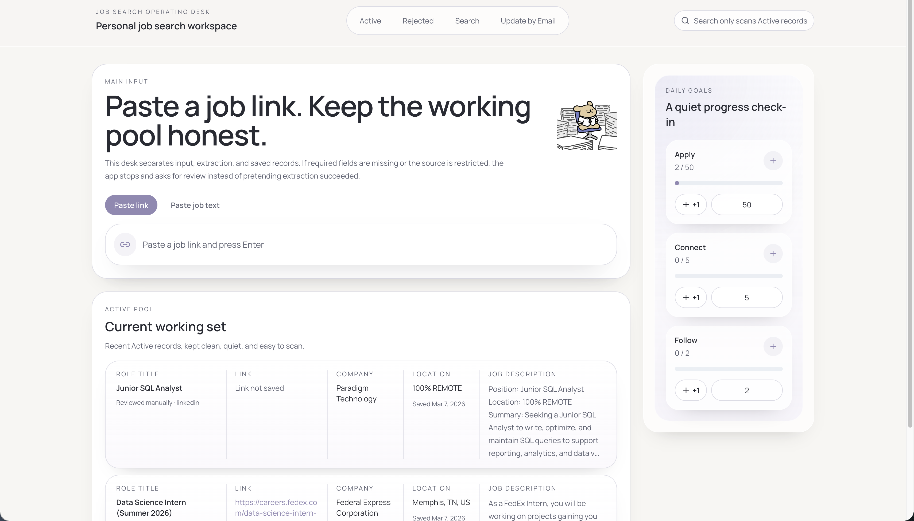
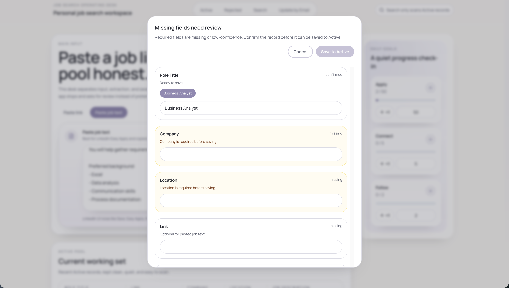
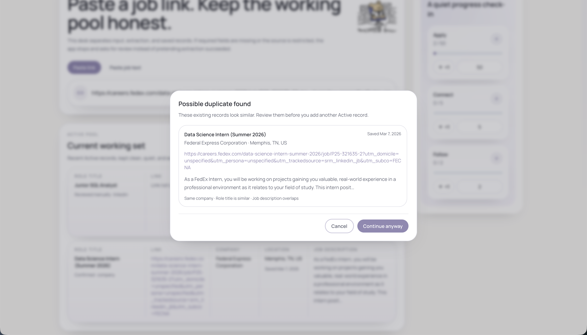
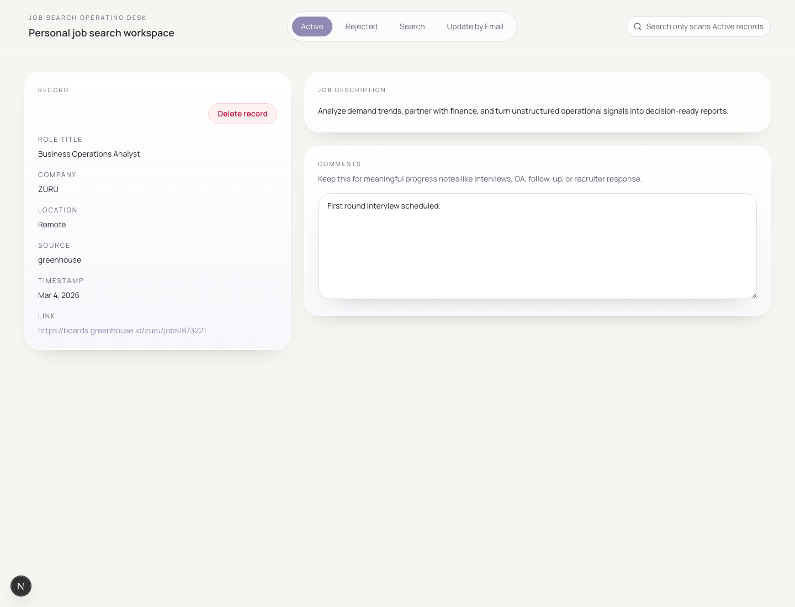

# Job Search Operating Desk

*A desktop-first personal workspace for managing job applications with calm structure and honest handling of uncertain data.*

Built for one user: the job seeker.

## Overview

Job Search Operating Desk is a real web app for turning messy job links, copied job text, uncertain extraction results, and rejection emails into a focused personal workflow. It is designed to handle uncertainty honestly instead of inventing clean data.

## Why I built it

Most job trackers felt too corporate, too decorative, or too confident about incomplete information. I wanted something quieter and more practical: a tool that keeps the active pool clean, supports imperfect input, and stays usable during real day-to-day job searching.

## What it does

- Capture a role from a pasted job link or copied job text
- Support LinkedIn Easy Apply style text intake when links are noisy or restricted
- Detect likely duplicates before saving
- Route incomplete or low-confidence records into manual review
- Keep search scoped to the Active working pool only
- Match rejection emails back to existing records
- Track daily counts for Apply, Connect, and Follow

## Screenshots

### Home



### Manual review for incomplete records



### Duplicate detection



### Active job detail



## Key workflows

### Capture from a job link

Paste a link and press Enter. The app detects the probable source, attempts extraction, validates required fields, checks for duplicates, and only saves to Active when the record is complete enough.

### Capture from pasted job text

Paste copied job text and press Enter. This path is especially useful for LinkedIn Easy Apply, recruiter-shared job descriptions, and postings where the original link is not worth storing. For this flow, the `Link` field may remain empty.

### Review uncertain records

If required fields are missing or extraction confidence is low, the app pauses and asks for manual review instead of pretending extraction succeeded.

### Update from rejection email

Paste rejection email text to find the most likely Active records and move the correct one into the Rejected archive.

## Design principles

The interface should never look more certain than the underlying data. Extraction is conservative, LinkedIn-style sources are handled realistically, and missing information triggers review instead of guesswork.

## Tech stack

- Next.js App Router
- TypeScript
- Tailwind CSS
- Framer Motion
- Drizzle migrations
- Postgres-ready persistence
- Local fallback store for offline development and isolated testing
- Vitest
- Playwright

## Local development

```bash
pnpm install
pnpm dev
```

Then open `http://localhost:3000`.

## Environment variables

For managed Postgres runtime:

- `DATABASE_URL`
- `DATABASE_URL_UNPOOLED`

For local development without Postgres, the app can fall back to a local file store.

For deployment and migration notes, see `docs/postgres-deployment.md`.

## Daily goals

`Apply` resets on `America/New_York` midnight boundaries. New Active records automatically increment `Apply`, while `Connect` and `Follow` are tracked as daily counts with manual updates.

## Demo

The actively used deployment is private because it contains real personal job-search data. A separate public-safe demo instance can be created later if needed.
