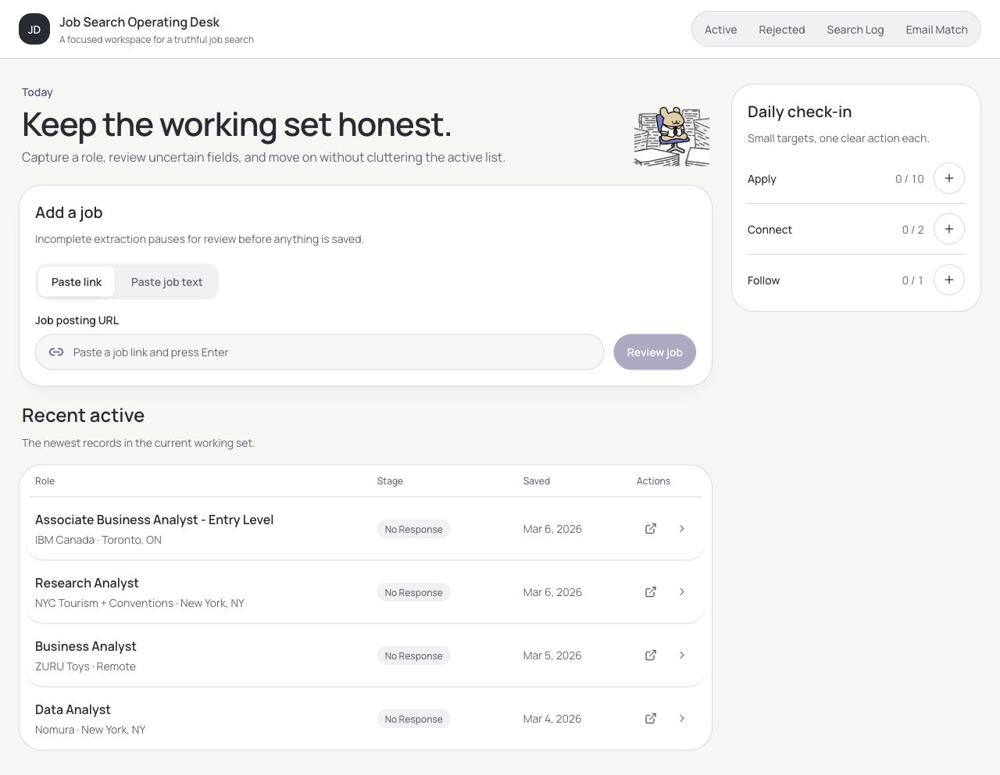

# Job Search Operating Desk

> A desktop-first personal workspace for managing job applications with calm structure and honest handling of uncertain data.

[Live app](https://job-search-operating-desk.vercel.app)



## At a glance

- Capture a job from a link or pasted text without pretending every field was extracted
- Route incomplete or low-confidence records to manual review
- Keep Active, follow-up notes, stages, rejection matching, and daily goals in one workflow
- Compare outcomes by search cycle and preserve each completed search as a fixed story

## Core workflow

`Job link or text → Extract → Validate → Review when uncertain → Active → Follow up → Rejected / Search Log`

## Documentation

- [Product overview and workflows](docs/product-overview.md)
- [Screenshot gallery](docs/screenshots.md)
- [Postgres deployment](docs/postgres-deployment.md)
- [Operations runbook](docs/operations-runbook.md)
- [Troubleshooting](docs/troubleshooting.md)

## Stack

Next.js App Router · TypeScript · Tailwind CSS · Server Actions · Drizzle · Postgres · Vitest · Playwright

## Run locally

```bash
pnpm install
pnpm dev
```

Open `http://localhost:3000`. Without Postgres credentials, the app can use its local development store.
